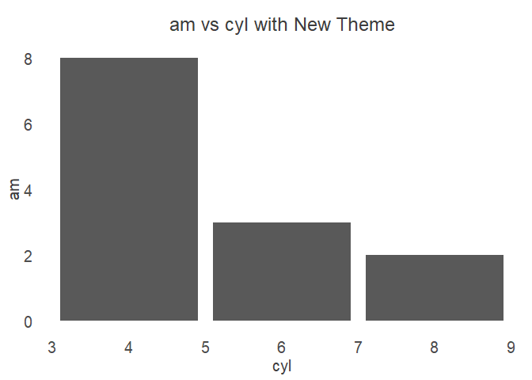

<!-- README.md is generated from README.Rmd. Please edit that file -->

# riyadh.helpers

<!-- badges: start -->
<!-- badges: end -->

## Personal Package to Save Time in Some of the Repetitive Tasks

This is a personal package that let me borrow code snippets that I use
on daily basis at my work such as ggplot2 company theme or branding
colors, etc..

## Installation

You can install the development version of riyadh.helpers like so:

``` r
# install.packages("devtools")
devtools::install_github("riyadh-radhi/riyadh.helpers")
```

## Example

### Load the library

``` r
library(riyadh.helpers)
```

### Exmple One

``` r
ggplot2::ggplot(data = datasets::mtcars)+
  ggplot2::geom_col(ggplot2::aes(x = cyl, y= am))+
  theme_kapita()+
  ggplot2::ggtitle(label = "am vs cyl with New Theme")
```



### Exmple Two

``` r
colors_kapita()
#> $green
#>    normal         1         2         3         4         5         6         7 
#> "#accb46" "#d6e3a3" "#cdde91" "#c4d87f" "#bdd46b" "#b4cf5a" "#9cb73f" "#8ba237" 
#>         8         9        10 
#> "#788e31" "#687a2a" "#576725" 
#> 
#> $turquaz
#>    normal         1         2         3         4         5         6         7 
#> "#0098a0" "#81cbcf" "#66c2c6" "#4bb7bc" "#33adb3" "#18a2a9" "#048990" "#007a80" 
#>         8         9        10 
#> "#006a71" "#005c61" "#004c50" 
#> 
#> $orange
#>    normal         1         2         3         4         5         6         7 
#> "#f9b036" "#fcd89b" "#fcd086" "#fbc871" "#fac05d" "#fab84b" "#e09e30" "#c78e2a" 
#>         8         9        10 
#> "#ae7b24" "#956a20" "#7d581b" 
#> 
#> $purple
#>    normal         1         2         3         4         5         6         7 
#> "#ab3d76" "#d69fbb" "#cd8bad" "#c4779f" "#bd6491" "#b45085" "#9b376a" "#8a315e" 
#>         8         9        10 
#> "#792b54" "#672547" "#561f3b" 
#> 
#> $title
#>         1 
#> "#3d3d3d" 
#> 
#> $source
#>         1 
#> "#194354"
```
